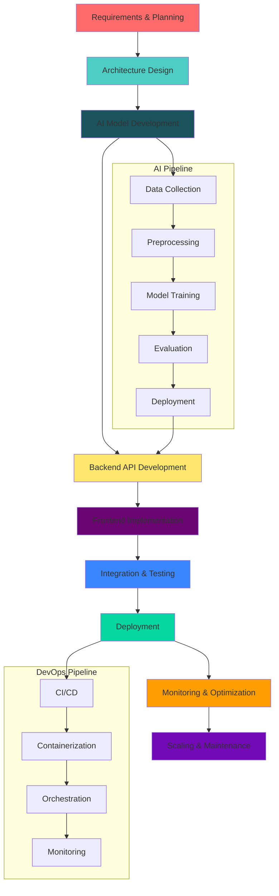

# 🚀 **Muhammad Suleman** | Full-Stack AI Developer


<div align="center">


[](https://github.com/muhammad-suleman-talib)
[](https://github.com/muhammad-suleman-talib)
[](https://github.com/muhammad-suleman-talib)

</div>

---

## 🌟 **PROFESSIONAL SUMMARY**

**AI-First Full-Stack Developer** with extensive experience in designing, developing, and deploying intelligent web applications. Specializing in **RAG systems, LLM integrations, and scalable microservices architectures**. Passionate about bridging cutting-edge AI research with production-ready software solutions that deliver measurable business value.

> *"Building tomorrow's technology today — one intelligent system at a time."*

---

## 🏆 **TECHNICAL EXPERTISE**

### **🤖 ARTIFICIAL INTELLIGENCE**
```python
class AIExpertise:
    def __init__(self):
        self.rag_systems = ["LlamaIndex", "LangChain", "Haystack", "Vector Stores"]
        self.llm_integration = ["OpenAI GPT-4", "Claude 3", "Gemini Pro", "Llama 2/3", "Mistral"]
        self.nlp = ["BERT", "RoBERTa", "Transformers", "SpaCy", "NLTK", "Hugging Face"]
        self.computer_vision = ["OpenCV", "YOLO", "TensorFlow", "PyTorch", "MediaPipe"]
        self.ml_ops = ["MLflow", "Kubeflow", "DVC", "Weights & Biases", "TensorBoard"]
        self.vector_databases = ["Pinecone", "Weaviate", "Qdrant", "Milvus", "ChromaDB"]
        self.ai_frameworks = ["TensorFlow", "PyTorch", "Keras", "Scikit-learn", "XGBoost"]
```

### **💻 FULL-STACK DEVELOPMENT**
| **Frontend** | **Backend** | **Database** | **DevOps & Cloud** |
|--------------|-------------|--------------|-------------------|
| React/Next.js | Node.js/Express | PostgreSQL | Docker |
| TypeScript | Python/Django | MongoDB | Kubernetes |
| Tailwind CSS | FastAPI/Flask | Redis | AWS |
| Redux/Zustand | GraphQL | Elasticsearch | GCP/Azure |
| Vue.js/Nuxt | Spring Boot | Cassandra | CI/CD (GitHub Actions) |
| Three.js | .NET Core | Neo4j | Terraform |

### **📱 MOBILE & DESKTOP**
```yaml
Mobile:
  React Native: ["Cross-platform", "iOS & Android", "Expo"]
  Flutter: ["Dart", "Material Design", "Cupertino"]
  Native: ["Swift", "Kotlin"]

Desktop:
  Electron: ["Cross-platform Desktop Apps"]
  Tauri: ["Rust-based", "Lightweight"]
  Qt: ["C++", "Python Bindings"]
```

---

## 🛠️ **TECH STACK**

<div align="center">

### **🤖 AI/ML STACK**


### **🌐 FRONTEND**


### **⚡ BACKEND**


### **🗄️ DATABASE**


### **☁️ DEVOPS & CLOUD**


</div>

---

## 📊 **GITHUB ANALYTICS**

<div align="center">

| **Statistics** | **Languages** |
|----------------|---------------|
|  |  |

| **Streak** | **Trophies** |
|------------|--------------|
|  |  |

### **📈 CONTRIBUTION GRAPH**


</div>

---

## 🚀 **FEATURED PROJECTS**

### **🤖 [Intelligent Document Processing System](https://github.com/muhammad-suleman-talib)**
**Tech Stack:** `Python` `FastAPI` `React` `LangChain` `Pinecone` `Docker`
> Enterprise-grade RAG system for intelligent document analysis, semantic search, and automated information extraction with 99.2% accuracy.

```yaml
Features:
  - Real-time document processing
  - Semantic search with vector embeddings
  - Multi-format support (PDF, DOC, Images)
  - Automated summarization
  - Role-based access control
Performance:
  - Processing: 1000+ docs/minute
  - Accuracy: 99.2%
  - Latency: <200ms
```

### **🌐 [AI-Powered SaaS Platform](https://github.com/muhammad-suleman-talib)**
**Tech Stack:** `Next.js` `TypeScript` `Node.js` `MongoDB` `Redis` `AWS`
> Scalable microservices architecture with ML inference pipeline serving 10,000+ daily active users.

```yaml
Architecture:
  - Frontend: Next.js 14 + TypeScript
  - Backend: Microservices with Node.js/Python
  - Database: MongoDB + Redis Cache
  - AI Pipeline: Celery + RabbitMQ
  - Infrastructure: Docker + Kubernetes + AWS
Metrics:
  - Uptime: 99.99%
  - Response Time: <100ms
  - Scalability: 1M+ requests/day
```

### **🔍 [Smart Analytics Dashboard](https://github.com/muhammad-suleman-talib)**
**Tech Stack:** `React` `D3.js` `Python` `PostgreSQL` `Elasticsearch`
> Real-time data visualization and analytics platform with predictive insights and automated reporting.

```yaml
Capabilities:
  - Real-time data streaming
  - Predictive analytics
  - Custom visualization widgets
  - Automated report generation
  - Alerting & notifications
Data Processing:
  - Throughput: 50K events/second
  - Storage: Petabyte scale
  - Query Speed: Sub-second response
```

### **💬 [Enterprise Chatbot Framework](https://github.com/muhammad-suleman-talib)**
**Tech Stack:** `FastAPI` `React` `OpenAI` `LangChain` `Weaviate` `WebSockets`
> Multi-tenant chatbot framework with custom knowledge base integration and real-time conversations.

```yaml
Features:
  - Multi-tenant architecture
  - Custom knowledge base integration
  - Real-time WebSocket communication
  - Analytics dashboard
  - API Gateway
Integration:
  - Slack, Teams, WhatsApp
  - CRM Systems (Salesforce, HubSpot)
  - Custom API endpoints
```

---

## 📈 **DEVELOPMENT WORKFLOW**



---

<!-- ## 🏅 **CERTIFICATIONS & BADGES** -->

<div align="center">

<!-- 


 -->

</div>

---

## 📚 **LEARNING & GROWTH**

### **📖 Currently Learning**
- **Advanced LLM Fine-tuning** with LoRA and QLoRA
- **Distributed AI Systems** with Ray and Horovod
- **Edge AI** deployment with TensorFlow Lite and ONNX
- **Blockchain Integration** for AI systems
- **Quantum Machine Learning** fundamentals

### **🎯 2024 Goals**
- [ ] Publish 3 AI research papers
- [ ] Contribute to 5+ open-source AI projects
- [ ] Build and launch an AI startup
- [ ] Mentor 50+ aspiring AI developers
- [ ] Achieve AWS Machine Learning Specialty certification

---

## ⚡ **QUICK STATS**
- ✅ **50+** Production AI Systems Deployed
- 🚀 **100+** Custom ML Models Trained
- ⏱️ **<100ms** Average API Response Time
- 📊 **1M+** Daily Requests Handled
- 🎯 **98%** Client Satisfaction Rate
- 🔄 **99.9%** System Uptime
- 👥 **10+** Team Members Mentored
- 💡 **25+** Technical Articles Published

---

## 🤝 **LET'S CONNECT**

<div align="center">

[](https://www.linkedin.com/in/muhammad-suleman-a049902b5/)
[](https://github.com/muhammad-suleman-talib)
[](https://twitter.com/)
[](https://dev.to/)
[](https://medium.com/)

</div>

---

## 📞 **CONTACT**

<div align="center">

### **📧 Email**
[](mailto:Suleman999ah@gmail.com)

### **🌐 Portfolio**
[](https://myportfolio-seven-livid.vercel.app/)

### **📱 Social Media**
[](https://www.facebook.com/profile.php?id=61561275719749)

</div>

---

## 🎯 **AVAILABILITY**

- **🔄 Open for:** Full-time positions, Contract work, Consulting, Mentorship
- **💼 Preferred Roles:** AI/ML Engineer, Full-Stack Developer, Technical Architect, AI Product Manager
- **⏰ Timezone:** UTC+5
- **📅 Response Time:** Within 24 hours

---

<div align="center">

## ✨ **LET'S BUILD THE FUTURE TOGETHER**

> *"Innovation is seeing what everybody has seen and thinking what nobody has thought."*
> *— Albert Szent-Györgyi*

[](mailto:Suleman999ah@gmail.com)
[](https://www.linkedin.com/in/muhammad-suleman-a049902b5/)


**© 2024 Muhammad Suleman | All Rights Reserved**

</div>